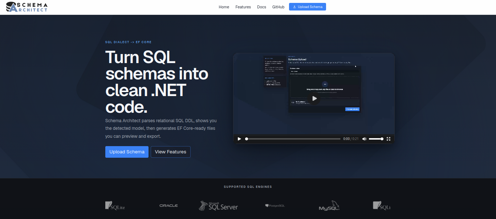
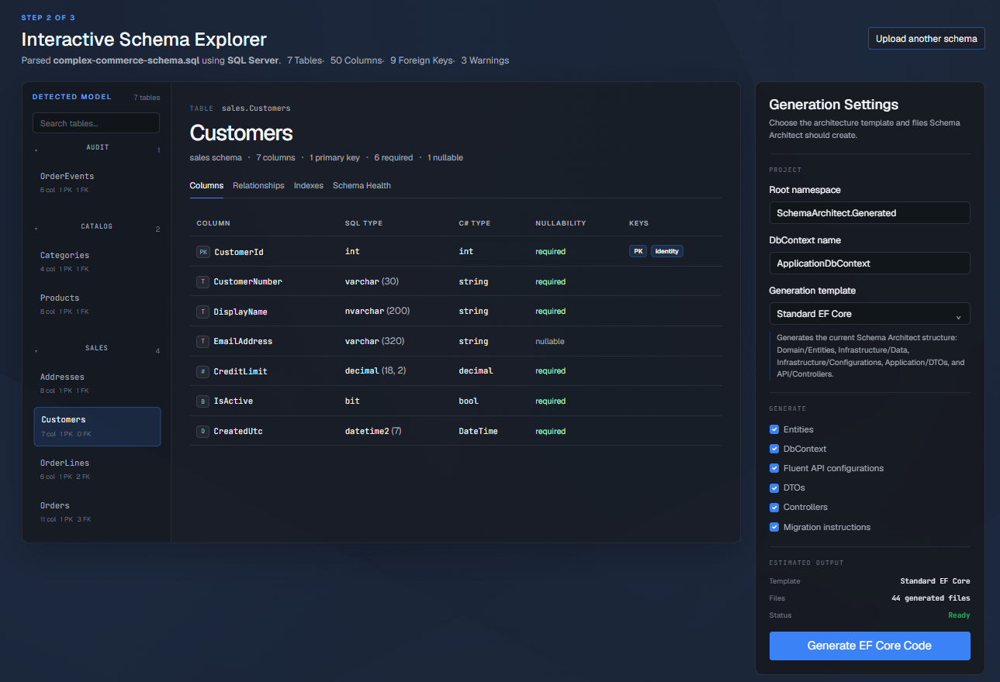
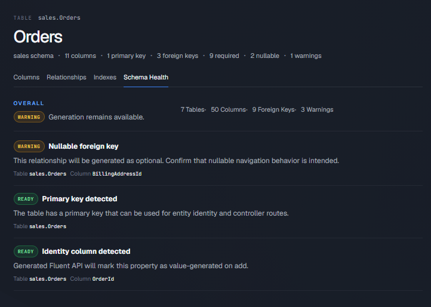
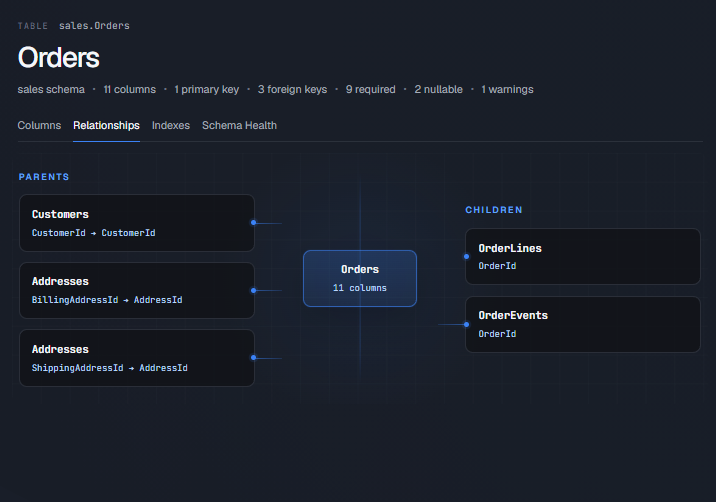
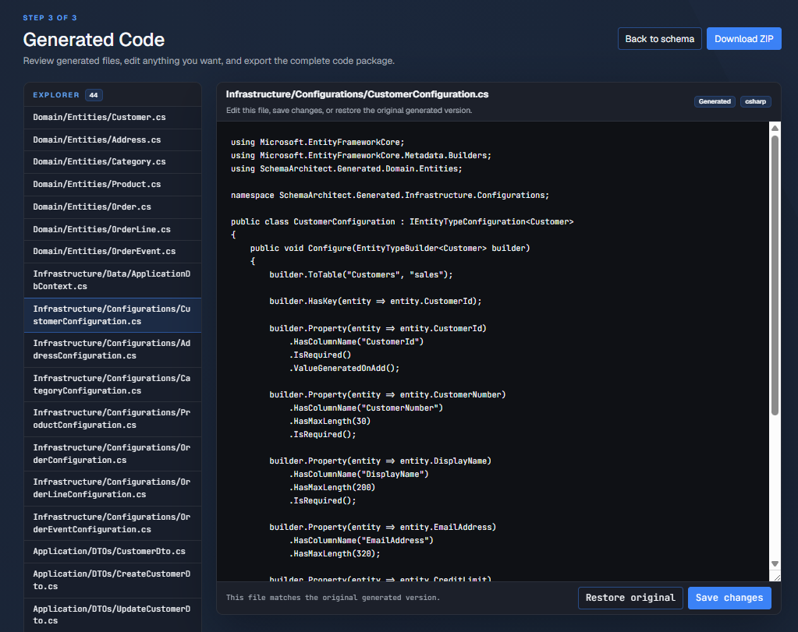

# Schema Architect

> **Version:** v0.1.0

Schema Architect is an ASP.NET Core Razor Pages application that generates an Entity Framework Core project foundation from SQL schema files.

Instead of manually recreating entity models, `DbContext`, Fluent API configurations, DTOs, and controller scaffolding, Schema Architect analyzes your database schema and generates a clean, reviewable starting point for your application.

The generated code is intended to accelerate development—not replace developer review or customization.

---

## Live Demo

**Try Schema Architect online:**

https://schemarchitect.azurewebsites.net/

> **Note**
>
> Generated projects are created in memory and are not permanently stored. Uploaded SQL files are processed temporarily and discarded after generation.

---

## Why Schema Architect?

Building an EF Core application from an existing database often involves repeating the same setup work:

- Creating entity classes
- Mapping SQL data types to C#
- Configuring primary and foreign keys
- Writing Fluent API configurations
- Creating DTOs
- Scaffolding CRUD controllers

Schema Architect automates these repetitive tasks so developers can spend less time writing boilerplate and more time building applications.

---

## Features

- Upload and validate `.sql` schema files
- Support for:
  - SQL Server
  - PostgreSQL
  - MySQL
  - SQLite
  - Oracle
  - IBM Db2
- Parse `CREATE TABLE` statements
- Detect:
  - Tables and schemas
  - Columns and SQL data types
  - Nullable and required fields
  - Primary keys
  - Identity columns
  - Foreign key relationships
  - String and binary length constraints
  - Decimal precision and scale
- Automatically map SQL types to C# types
- Preview the parsed schema before generation
- Generate:
  - Entity Framework Core entity classes
  - `DbContext`
  - Fluent API (`IEntityTypeConfiguration<T>`) classes
  - Create, Read, and Update DTOs
  - CRUD controller scaffolding
  - EF Core migration instructions
- Preview generated source code directly in the browser
- Download the generated project as a ZIP archive

---

## Tech Stack

- .NET 9
- ASP.NET Core Razor Pages
- Entity Framework Core
- Bootstrap
- xUnit
- GitHub Actions
- Azure App Service

---

### Home


### Upload SQL Schema


### Schema Preview




### Generated Code Preview


## Project Structure

```text
SchemaArchitect
├── SchemaArchitect.Core
│   ├── Generation
│   ├── Interfaces
│   ├── Models
│   ├── Parsing
│   └── Services
├── SchemaArchitect.Web
│   ├── Pages
│   ├── Services
│   └── ViewModels
├── SchemaArchitect.Tests
└── samples
```
---
## Notes

If you have questions, suggestions, or would like to contribute, feel free to open an issue or submit a pull request.
